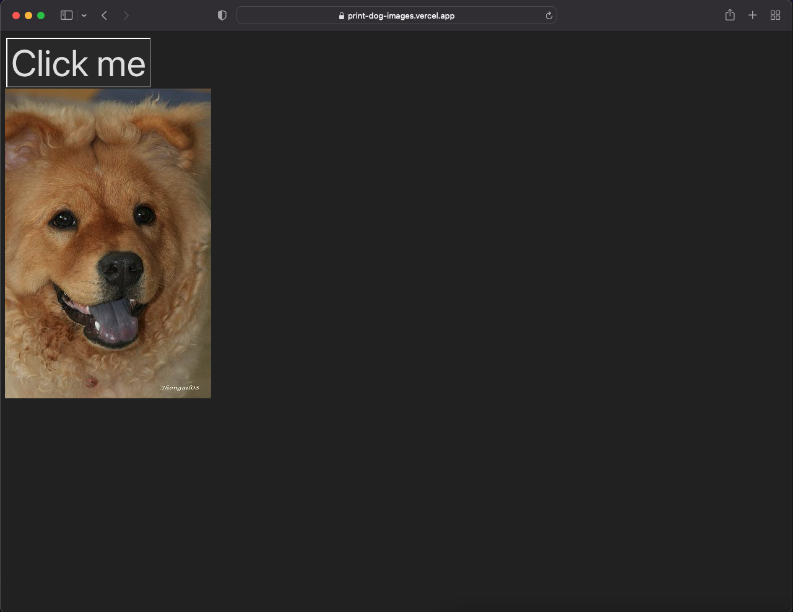

# Print Dog Images
Aplicativo que interage com "Dog API" e mostra para o usuário imagens aleatórias de cachorros.

### Funcionalidades
<ul>
  <li> O App mostra uma foto diferente de diversos cachorros que estão no banco de dados do "Dog API" com um clique. </ li>
  <li> Cada clique faz uma nova requisição e uma nova imagem é carregada. </ li>
</ul>

### Tecnologias e ferramentas
<ul>
  <li> ReactJS </ li>
  <li> Api fetch </ li>
  <li> CSS </ li>
</ul>

### App 
Link para o <a href="https://print-dog-images.vercel.app/"> App </a>.
Link para a <a href="https://dog.ceo/dog-api/"> API </a>.

